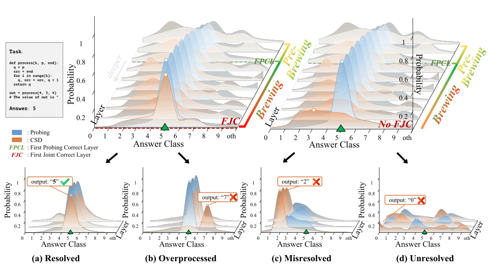
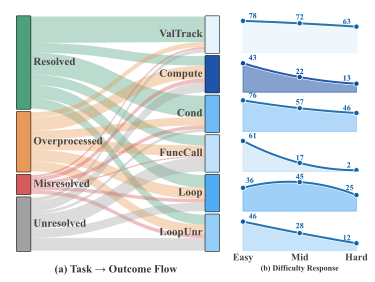

<div align="center">

# ☕ Brewing

### 追踪 LLM 代码推理的内部逐层生命周期

[](https://arxiv.org/abs/2606.17648)
[](https://github.com/euyis1019/llm-brewing/tree/paper_experiment)

[English](README.md) · **中文**

<em>从答案在 hidden state 中变得 <b>可读</b> 的那一刻，<br/>到模型真正能 <b>用上</b> 它的那一刻。</em>

</div>

---

**Brewing** 追踪 LLM 在做代码推理时，答案在内部逐层形成的完整生命周期。这是论文 [*"From Brewing to Resolution: Tracing the Internal Lifecycle of Code Reasoning in LLMs"*](https://arxiv.org/abs/2606.17648) 的官方代码，涵盖基准构建、hidden-state 缓存、逐层方法、诊断以及因果验证。

> 📦 **代码在哪里**
> `main` 分支只是这个首页（README、图片、docs）。**全部实验代码都在 [`paper_experiment`](https://github.com/euyis1019/llm-brewing/tree/paper_experiment) 分支** —— 复现论文所需的框架、基准、方法、诊断和因果验证都在那里。
>
> ```bash
> git clone https://github.com/euyis1019/llm-brewing.git
> cd llm-brewing
> git checkout paper_experiment
> ```
>
> 在 GitHub 上浏览：**[github.com/euyis1019/llm-brewing/tree/paper_experiment](https://github.com/euyis1019/llm-brewing/tree/paper_experiment)**

> 🚧 **提醒**
> 这个仓库已经能跑通我们的实验，但仍在积极重构中。我们同时也在**更强、更大的开源模型上做 scaling 实验**，验证同一现象能延伸到多远。如果你想要一个稳定的框架来二次开发，建议稍等一下更干净的正式版。
>
> 💬 我很好联系，欢迎提问、issue 和各种奇怪的边界情况。
> 📦 仓库：[llm-brewing](https://github.com/euyis1019/llm-brewing)
> 📫 邮箱：[ifguo1019@qq.com](mailto:ifguo1019@qq.com)

## 这项工作在研究什么

标准的准确率只告诉你模型最后答没答对，却不告诉你这个答案在内部是怎么形成的：它是不是很早就形成、随后又被破坏了？还是说信息其实已经存在于表征里，只是模型自己还用不上？

Brewing 把代码推理看成一个**内部的逐层生命周期**，而不是一个只看最终输出的事件。核心论点是：答案往往会**先**在 hidden state 中变得线性可读，**之后**才被模型自己解码出来。这个中间状态我们称之为 `brewing`（酝酿）。

我们用两个互补的视角追踪这个生命周期：

- `linear_probing`：答案是否已经能从 hidden state 中被外部线性读出？
- `csd`：模型自己能否从该状态解码出答案？

两者之差给了一个具体的方式来衡量「从表征到可用计算」的转变。这个过程一旦成功或失败，样本就会落入不同的 outcome 类型：`resolved`（成功）、`overprocessed`（曾对后被破坏）、`misresolved`（自信地错）、`unresolved`（没算完）。

[](assets/resolution_taxonomy.pdf)

在任务层面，本项目不只问哪些代码推理问题更难，而是问每类任务会诱发**哪种内部失败**。横跨值追踪、算术、条件分支、函数调用和循环推理，outcome 的分布像一个指纹，刻画着一次计算是如何在网络中被推进的。

[](assets/task_fingerprint.pdf)

横跨不同模型家族和规模，brewing-to-resolution 的核心骨架出奇地稳定；真正随模型能力提升的，是 brewing 最终**酝酿成一个被保留下来的正确答案**的概率。

[](assets/brewing_stability.pdf)

> 图片均可点击，跳转到原始 PDF 矢量图。

## 这个仓库做什么

Brewing 是实现上述分析流水线的代码库。主工作流是：

1. 构建或加载基准数据集。
2. 把 hidden states 抽取进缓存。
3. 运行 linear probing、CSD 等分析方法。
4. 推导 FPCL、FJC、brewing gap、outcome 标签等诊断。
5.（可选）在已保存的输出上跑因果验证实验。

仓库默认基准是 `CUE-Bench`，包含六个代码推理子集：

- `value_tracking`
- `computing`
- `conditional`
- `function_call`
- `loop`
- `loop_unrolled`

## 仓库结构

> 下面的目录树位于 [`paper_experiment`](https://github.com/euyis1019/llm-brewing/tree/paper_experiment) 分支。在 `main` 上你只会看到本 README、`assets/` 图片和 `docs/`。

```text
brewing/
  benchmarks/         基准 spec、builder、adapter、内置数据
  causal/             因果干预后端与验证器
  config/             示例与批量 YAML 配置
  diagnostics/        outcome 分类法与聚合指标
  methods/            linear probing 与 CSD
  pipelines/          cache_only / train_probing / eval / diagnostics / causal_validation
  schema/             共享数据类与序列化
  cli.py              `python -m brewing` 的 CLI 入口
docs/
  project_overview.md 高层架构说明
  running_modes.md    各运行模式的详细行为
scripts/              冒烟测试与实验辅助脚本
tests/                单元与集成测试
```

## 安装

> 下面所有命令都需要 [`paper_experiment`](https://github.com/euyis1019/llm-brewing/tree/paper_experiment) 分支上的代码 —— 先执行 `git checkout paper_experiment`。

最小安装：

```bash
pip install -e .
```

若需要依赖模型的运行（缓存抽取、CSD、因果验证）：

```bash
pip install -e .[model]
```

测试依赖：

```bash
pip install -e .[dev]
```

需要 Python `>=3.10`。

## 快速开始

最小可运行路径是内置 fixture 配置：

```bash
python -m brewing --config brewing/config/example_single_task.yaml
```

该配置使用：

- `use_fixture: true`
- 一个子集：`value_tracking`
- 一个方法：`linear_probing`

这是在不搭建完整实验的前提下，最快验证 CLI 与输出布局的方式。

查看可用的配置示例：

```text
brewing/config/example_single_task.yaml
brewing/config/example_probing_tune.yaml
brewing/config/example_local_model.yaml
brewing/config/example_14b_int8.yaml
brewing/config/example_full_reference.yaml
brewing/config/experiments/*.yaml
```

## 运行流水线

CLI 入口：

```bash
python -m brewing --config path/to/config.yaml --verbose
```

Brewing 目前支持五种运行模式。

| 模式 | 用途 | 是否需要在线模型 |
| --- | --- | --- |
| `cache_only` | 构建/加载数据集并抽取 hidden-state 缓存 | 需要，除非所有缓存都已存在 |
| `train_probing` | 从 train-split 缓存训练 probe 工件 | 需要，除非所需缓存都已存在 |
| `eval` | 在 eval 数据上运行 `linear_probing`、`csd` 等方法 | 取决于所选方法 |
| `diagnostics` | 加载已保存的方法结果并计算 outcome 诊断 | 不需要 |
| `causal_validation` | 基于已有 S0-S3 工件运行干预实验 | 需要 |

典型工作流：

1. 跑 `cache_only` 构建 train 和/或 eval 缓存。
2. 跑 `train_probing` 产出 probe 工件。
3. 跑 `eval` 生成 `MethodResult` 输出。
4. 跑 `diagnostics` 计算 FPCL、FJC、brewing gap 和 outcome 标签。
5. 如需基于干预的后续实验，跑 `causal_validation`。

## 核心概念

当前代码库里有两个一等公民的分析方法：

- `linear_probing`：用训练好的逐层 probe，从缓存的 hidden state 中读取答案信息。
- `csd`：用在线模型评估模型能否从给定 hidden state 中解码出答案。

诊断在方法执行**之后**计算，且有意与主评估流水线解耦。主要输出包括：

- hidden-state 缓存
- probe 工件
- 各方法的结果文件
- 诊断汇总
- 因果验证结果文件

## 输出

所有工件写到 `output_root`（默认：`brewing_output/`）下。实际目录按基准、split、子集、seed、模型、方法组织。

常见输出分组：

- `datasets/...`
- `caches/...`
- `artifacts/...`
- `results/...`
- `run_summary.json`

具体路径逻辑由 `brewing/resources.py` 管理。

## 文档地图

想理解或修改框架，从这里开始：

- [docs/project_overview.md](docs/project_overview.md)
- [docs/running_modes.md](docs/running_modes.md)
- [brewing/config/README.md](https://github.com/euyis1019/llm-brewing/blob/paper_experiment/brewing/config/README.md)（在 `paper_experiment`）
- [brewing/config/experiments/README.md](https://github.com/euyis1019/llm-brewing/blob/paper_experiment/brewing/config/experiments/README.md)（在 `paper_experiment`）

## 测试

运行自动化测试套件：

```bash
pytest
```

还有一个更重的、依赖模型的端到端冒烟脚本：

```bash
python scripts/test_e2e_smoke.py
```

该脚本假设本地已有模型资产和预构建的实验数据，因此不是零配置即可运行的检查。

## 当前状态

框架已可使用，并围绕可复用的流水线进行了结构化；但周边部分文档仍停留在更早的重构阶段。要了解实际行为，请优先参考代码和配置示例，而非旧的叙述性文字。

## 引用

```bibtex
@misc{chen2026brewingresolutiontracinginternal,
  title={From Brewing to Resolution: Tracing the Internal Lifecycle of Code Reasoning in LLMs},
  author={Siyue Chen and Yifu Guo and Yuquan Lu and Zishan Xu and Jiaye Lin and
          Jianbo Lin and Siyu Zhang and Cheng Yang and Junxin Li and Yujia Li and
          Yu Huo and Ruixuan Wang},
  year={2026},
  eprint={2606.17648},
  archivePrefix={arXiv},
  primaryClass={cs.AI},
  url={https://arxiv.org/abs/2606.17648},
}
```
