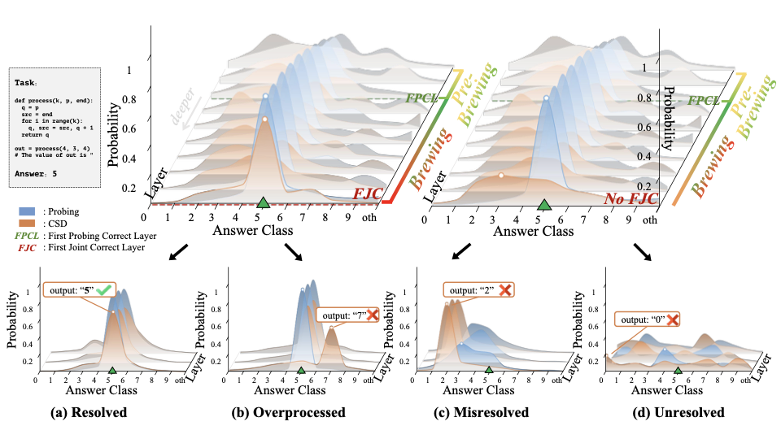
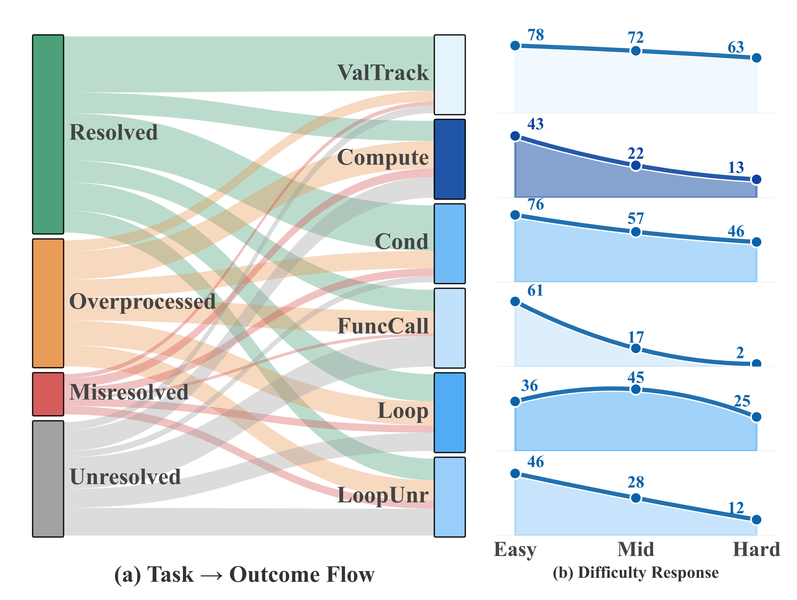
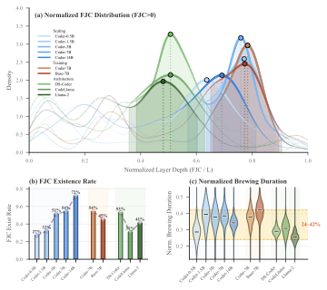

# Brewing

Code repository for the experiments in "From Brewing to Resolution: Tracing the Internal Lifecycle of Code Reasoning in LLMs".

This repository is the implementation side of the project: benchmark construction, hidden-state caching, layer-wise methods, diagnostics, and causal validation. The paper source lives in the sibling directory [`../CUE-experiment-main`](../CUE-experiment-main).

> 🚧 **Heads-up**
> This repo already runs our experiments, but it is still being actively refactored. We are also running **scaling experiments on stronger and larger open-weight models** to test how far the same phenomenon holds up. If you want a stable framework to build on, it is probably better to wait a bit for the cleaner release.
>
> 💬 I am pretty easy to catch up with and very open to questions, issues, and weird edge cases.
> 📦 Repo: [llm-brewing](https://github.com/euyis1019/llm-brewing)
> 📫 Email: [ifguo1019@qq.com](mailto:ifguo1019@qq.com)

## What This Work Is About

Standard accuracy only tells you whether a model got the answer right. It does not tell you how that answer formed internally, whether it formed early and was later destroyed, or whether the information was already present in the representation but not yet usable by the model itself.

Brewing studies code reasoning as an internal layer-wise lifecycle rather than a final-output event. The central claim is that answers often become linearly readable from hidden states before they become decodable by the model itself. We call that intermediate regime `brewing`.

We track this lifecycle with two complementary views:

- `linear_probing`: is the answer already externally readable from the hidden state?
- `csd`: can the model itself decode the answer from that state?

Their gap gives a concrete way to measure the transition from representation to usable computation. Once that process succeeds or fails, examples fall into distinct outcome types such as `resolved`, `overprocessed`, `misresolved`, and `unresolved`.



At the task level, the project asks not just which code reasoning problems are hard, but what kind of internal failure each task induces. Across value tracking, arithmetic, conditionals, function calls, and loop-based reasoning, the outcome distribution acts like a fingerprint of how a computation is being carried through the network.



Across model families and scales, the core brewing-to-resolution scaffold appears surprisingly stable, while what improves with model capability is the chance that brewing actually resolves into a preserved correct answer.



## What This Repo Does

Brewing is the codebase that implements this analysis pipeline. The main workflow is:

1. Build or load a benchmark dataset.
2. Extract hidden states into a cache.
3. Run analysis methods such as linear probing and CSD.
4. Derive diagnostics such as FPCL, FJC, brewing gap, and outcome labels.
5. Optionally run causal validation experiments on saved outputs.

The default benchmark in this repo is `CUE-Bench`, which contains six code-reasoning subsets:

- `value_tracking`
- `computing`
- `conditional`
- `function_call`
- `loop`
- `loop_unrolled`

## Repository Layout

```text
brewing/
  benchmarks/         Benchmark specs, builders, adapters, built-in data
  causal/             Causal intervention backends and validators
  config/             Example and batch YAML configs
  diagnostics/        Outcome taxonomy and aggregate metrics
  methods/            Linear probing and CSD
  pipelines/          cache_only / train_probing / eval / diagnostics / causal_validation
  schema/             Shared dataclasses and serialization
  cli.py              CLI entry point used by `python -m brewing`
docs/
  project_overview.md High-level architecture notes
  running_modes.md    Detailed mode-by-mode behavior
scripts/              Smoke tests and experiment helpers
tests/                Unit and integration tests
```

## Installation

Minimal install:

```bash
pip install -e .
```

If you need model-backed runs such as cache extraction, CSD, or causal validation:

```bash
pip install -e .[model]
```

For test dependencies:

```bash
pip install -e .[dev]
```

Python `>=3.10` is required.

## Quick Start

The smallest runnable path is the built-in fixture config:

```bash
python -m brewing --config brewing/config/example_single_task.yaml
```

That config uses:

- `use_fixture: true`
- one subset: `value_tracking`
- one method: `linear_probing`

It is the fastest way to verify the CLI and output layout without setting up a full experiment run.

To inspect available config examples:

```text
brewing/config/example_single_task.yaml
brewing/config/example_probing_tune.yaml
brewing/config/example_local_model.yaml
brewing/config/example_14b_int8.yaml
brewing/config/example_full_reference.yaml
brewing/config/experiments/*.yaml
```

## Running The Pipeline

The CLI entry point is:

```bash
python -m brewing --config path/to/config.yaml --verbose
```

Brewing currently supports five run modes.

| Mode | Purpose | Needs online model |
| --- | --- | --- |
| `cache_only` | Build/load dataset and extract hidden-state caches | Yes, unless all caches already exist |
| `train_probing` | Train probe artifacts from train-split caches | Yes, unless required caches already exist |
| `eval` | Run methods such as `linear_probing` and `csd` on eval data | Depends on selected methods |
| `diagnostics` | Load saved method results and compute outcome diagnostics | No |
| `causal_validation` | Run intervention experiments from existing S0-S3 artifacts | Yes |

Typical workflow:

1. Run `cache_only` to build train and/or eval caches.
2. Run `train_probing` to produce probe artifacts.
3. Run `eval` to generate `MethodResult` outputs.
4. Run `diagnostics` to compute FPCL, FJC, brewing gap, and outcome labels.
5. Run `causal_validation` if you want intervention-based follow-up experiments.

## Core Concepts

Two analysis methods are first-class in the current codebase:

- `linear_probing`: reads answer information from cached hidden states using trained per-layer probes.
- `csd`: evaluates whether the model can decode the answer from a given hidden state using an online model.

Diagnostics are computed after method execution and are intentionally decoupled from the main evaluation pipeline. The main outputs include:

- hidden-state caches
- probe artifacts
- per-method result files
- diagnostic summaries
- causal validation result files

## Outputs

All artifacts are written under `output_root` (default: `brewing_output/`). In practice the tree is organized by benchmark, split, subset, seed, model, and method.

Common output groups include:

- `datasets/...`
- `caches/...`
- `artifacts/...`
- `results/...`
- `run_summary.json`

The exact path logic is managed by `brewing/resources.py`.

## Documentation Map

If you are trying to understand or modify the framework, start here:

- [docs/project_overview.md](docs/project_overview.md)
- [docs/running_modes.md](docs/running_modes.md)
- [brewing/config/README.md](brewing/config/README.md)
- [brewing/config/experiments/README.md](brewing/config/experiments/README.md)

## Tests

Run the automated test suite with:

```bash
pytest
```

There is also a heavier smoke script for model-backed end-to-end checks:

```bash
python scripts/test_e2e_smoke.py
```

That script assumes local model assets and prebuilt experiment data, so it is not a zero-setup check.

## Current State

The framework is usable and already structured around reusable pipelines, but parts of the surrounding docs still reflect an earlier refactor stage. For behavior, prefer the code and config examples over old narrative text.

## Citation

```bibtex
@misc{brewing2026,
  title={From Brewing to Resolution: Tracing the Internal Lifecycle of Code Reasoning in LLMs},
  author={Chen, Siyue and Guo, Yifu and Lu, Yuquan and Xu, Zishan and Lin, Jiaye and
          Lin, Jianbo and Zhang, Siyu and Yang, Cheng and Li, Junxin and Li, Yujia and
          Huo, Yu and Wang, Ruixuan},
  year={2026},
  note={Under review},
}
```
