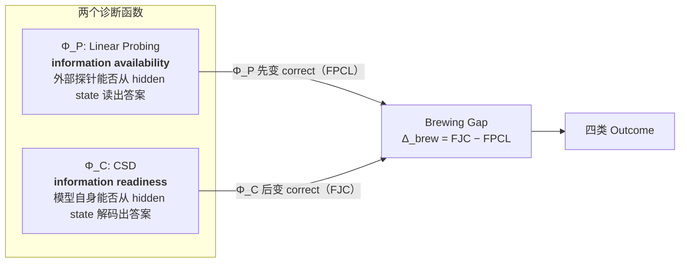
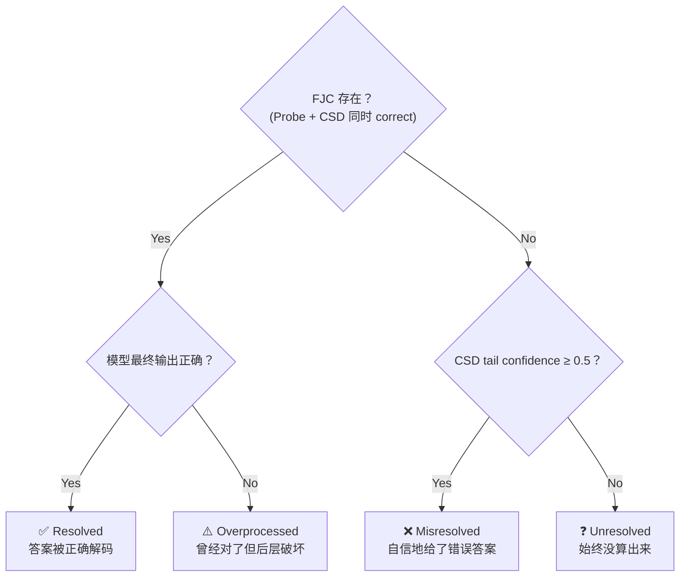
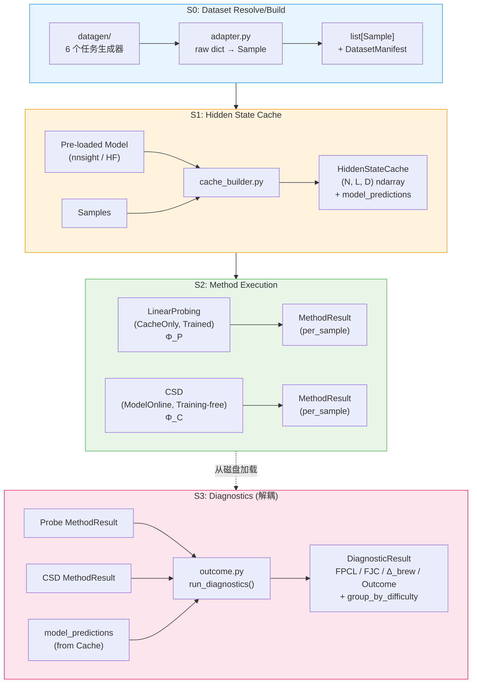
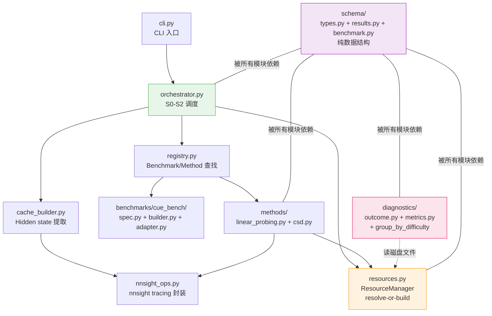
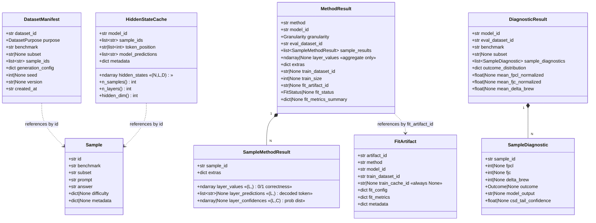
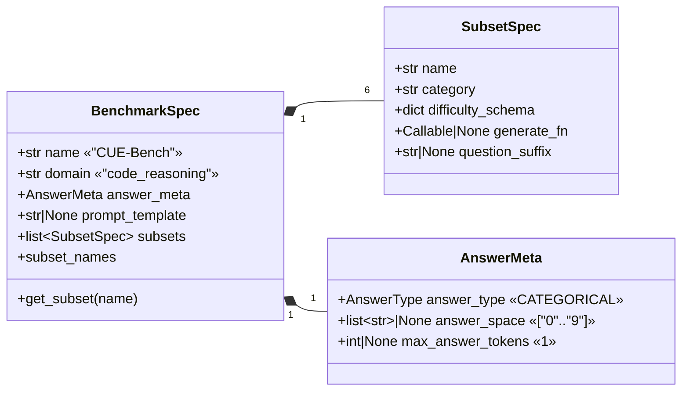
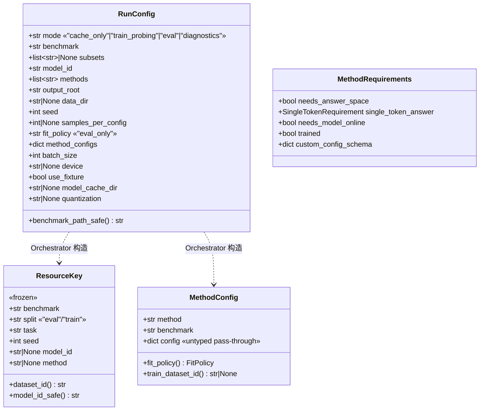
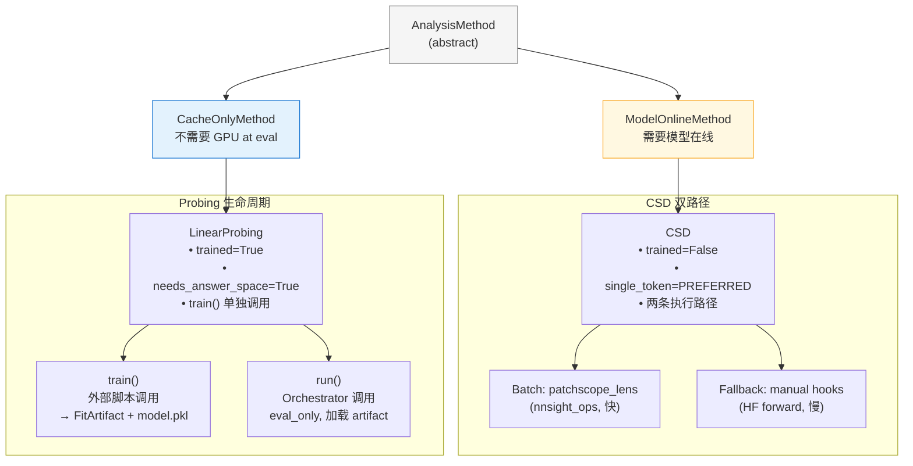
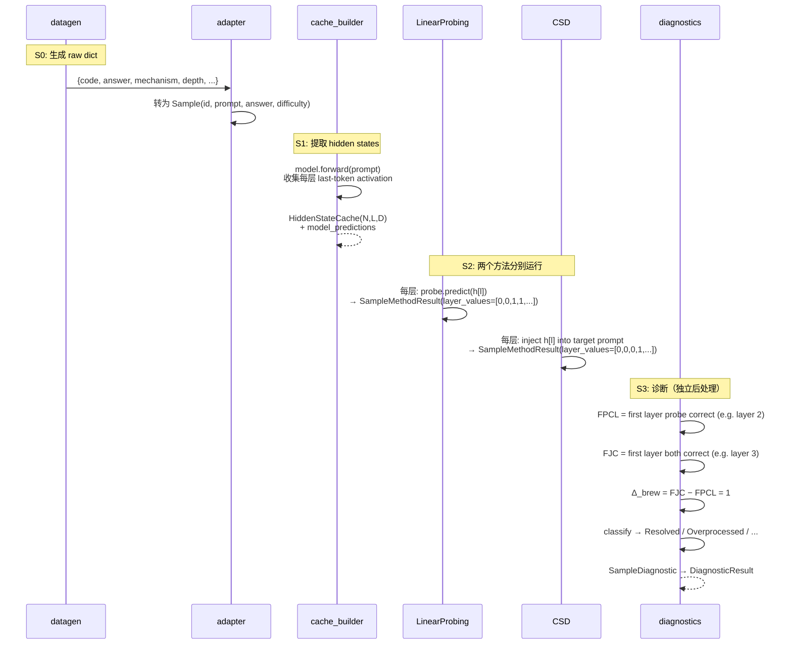
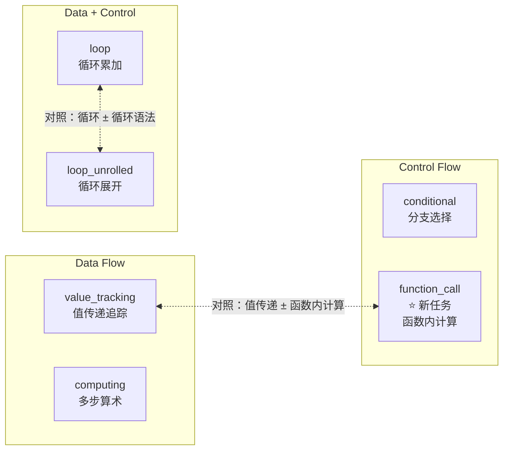

# Brewing Framework — Project Overview

> 本文档用于快速接手 Brewing 框架。所有 Mermaid 图可在 GitHub / VS Code / 任意 Markdown 预览器中渲染。

---

## 1. 研究背景：一句话版本

> LLM 在逐层处理代码推理任务时，答案信息会经历 **"先存在、后可用"** 的内部生命周期。Brewing 框架通过两个互补的诊断函数来追踪这个过程。



两者的时间差（层数差）定义了 **brewing-to-resolution** 结构，最终每个样本被分类为四类 outcome 之一：



---

## 2. Pipeline 架构（S0 → S3）



**关键设计决策**：
- S0-S2 由 `Orchestrator` 统一驱动
- S3 与 pipeline **完全解耦**，通过 `run_diagnostics_from_disk()` 从磁盘文件独立运行
- Probing 的训练（`LinearProbing.train()`）在主 pipeline **之外**单独执行，主 pipeline 只做 eval_only

---

## 3. 代码模块关系



---

## 4. 数据结构全景

### 4.1 类型层次关系



### 4.2 Benchmark 定义结构



### 4.3 配置与资源定位



---

## 5. 磁盘布局

`ResourceManager` 管理所有持久化资源，路径由 `ResourceKey` 决定：

```
{output_root}/
├── datasets/{benchmark}/{split}/{task}/seed{seed}/
│   ├── manifest.json          ← DatasetManifest
│   └── samples.json           ← list[Sample]
│
├── caches/{benchmark}/{split}/{task}/seed{seed}/{model_id_safe}/
│   ├── hidden_states.npz      ← HiddenStateCache.hidden_states (N,L,D)
│   └── meta.json              ← model_id, sample_ids, model_predictions
│
├── artifacts/{benchmark}/{task}/{model_id_safe}/{method}/seed{seed}/
│   ├── metadata.json          ← FitArtifact
│   └── model.pkl              ← sklearn probes (pickle)
│
└── results/{benchmark}/{split}/{task}/seed{seed}/{model_id_safe}/
    ├── linear_probing.json    ← MethodResult
    ├── csd.json               ← MethodResult
    └── diagnostics.json       ← DiagnosticResult
```

---

## 6. Method 类型体系



---

## 7. 数据流：一个样本的完整旅程



---

## 8. 六个任务



每个任务统一：**27 配置 × 150 samples/config = 4,050 样本**，答案均为单 digit (0-9)。

每个任务的 difficulty 由三个维度组成（SubsetSpec.difficulty_schema），维度值的笛卡尔积 = 27 配置：

| 任务 | 维度 1 | 维度 2 | 维度 3 |
|------|--------|--------|--------|
| value_tracking | mechanism (3) | depth (3) | distractors (3) |
| computing | structure (3) | steps (3) | operators (3) |
| conditional | branch_type (3) | depth (3) | condition_type (3) |
| function_call | mechanism (3) | depth (3) | distractors (3) |
| loop | body_type (3) | iterations (3) | init_offset (3) |
| loop_unrolled | body_type (3) | iterations (3) | init_offset (3) |

---

## 9. 论文实验规模

```
6 tasks × 9 models × {Probing, CSD} = 108 组 MethodResult
                                      → 54 组 DiagnosticResult
```

每组 MethodResult 包含 4,050 个 SampleMethodResult，每个有 L 层的逐层指标。

---

## 10. 已知设计问题

| # | 问题 | 位置 | 影响 |
|---|------|------|------|
| 1 | **MethodResult 双模态**：per_sample 和 aggregate 字段共存于一个 class，大量字段互斥为 None | `schema/results.py` | 可读性差，容易误用 |
| 2 | **训练元数据冗余**：FitArtifact.fit_metrics vs MethodResult.fit_metrics_summary 是同一数据的副本 | `results.py` + `linear_probing.py` | 一致性风险 |
| 3 | **answer_space 散落四处**：BenchmarkSpec / LinearProbing.DIGIT_CLASSES / MethodConfig.config / CSD default | 多个文件 | 应有单一来源 |
| 4 | **model_predictions 只存在 Cache 中**，但 S3 诊断需要它 → S3 必须依赖 cache 文件 | `outcome.py` + `types.py` | 破坏 S3 解耦设计 |
| 5 | **FitArtifact.train_cache_id** 永远是 None | `linear_probing.py:277` | 死字段 |
| 6 | **MethodConfig.config** 是 untyped dict | `results.py` | 无 schema 校验，silent misconfiguration |
| 7 | **N_CLASSES=11 硬编码** | `linear_probing.py` | 应从 answer_space 推导 |
| 8 | **resolve_artifact_with_policy()** 中 auto/force 模式无调用者 | `resources.py:265` | 死代码 |
| 9 | **无训练脚本**：`LinearProbing.train()` 已实现但无配套的 CLI/脚本入口 | 缺失 | 训练需手动写 Python 调用 |
