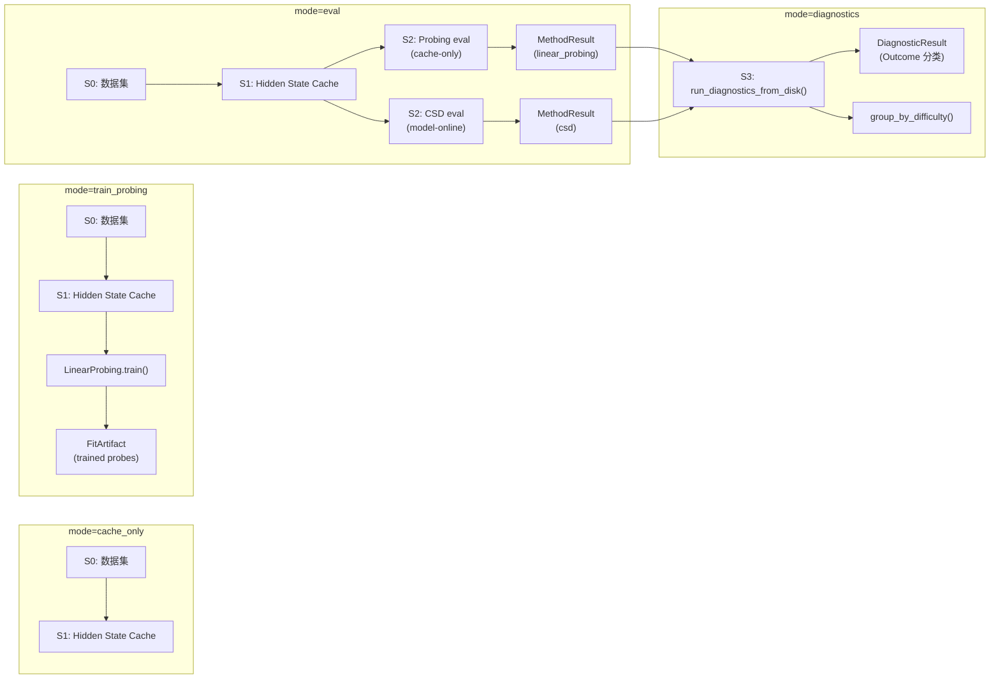

# Brewing 运行模式指南

> 本文档梳理 Brewing 框架的四种运行模式（`RunConfig.mode`）、各自产出的数据类型，以及这些数据如何被下游消费。

---

## 概览

Brewing 的完整 pipeline 由四个阶段组成（S0–S3），但并不是每次运行都需要走完所有阶段。`RunConfig.mode` 显式声明运行模式：

| 模式 | `RunConfig.mode` | 对应阶段 | 是否需要 GPU / 模型 | 典型场景 |
|------|-----------------|---------|-------------------|---------|
| **只建 Cache** | `cache_only` | S0 → S1 | 需要 | 只做数据集构建和 hidden state 提取 |
| **Probe 训练** | `train_probing` | S0 → S1 → fit | 需要（构建 cache） | 在 train split 上训练 per-layer logistic regression |
| **Pipeline 评测** | `eval` | S0 → S1 → S2 | 视方法而定（见下文） | 在 eval split 上运行 Probing + CSD，产出 MethodResult |
| **诊断后处理** | `diagnostics` | S3 only | 不需要 | 从磁盘加载 MethodResult，计算 Outcome 分类与诊断指标 |

> **阶段解耦**：S0–S2 各阶段均采用 **resolve-or-build** 模式——如果磁盘上已有对应产物则直接加载跳过，否则才构建。
>
> - **S3 本身就是独立入口**（`run_diagnostics_from_disk()`），不经过 Orchestrator
> - 合法的 mode 值定义在 `VALID_MODES = ("cache_only", "train_probing", "eval", "diagnostics")`



---

## 模式: 只建 Cache (`mode=cache_only`)

### 目的

只完成 S0（数据集构建）和 S1（hidden state 提取），不运行任何分析方法。适用于先在 GPU 集群上提取所有模型的 cache，然后在 CPU 上离线跑 Probing eval。

### 使用

设置 `mode: cache_only`，Orchestrator 会在完成 S0+S1 后停止，S2 循环不执行。

---

## 模式: Probe 训练 (`mode=train_probing`)

### 目的

在 **train split** 的 hidden states 上，为每一层训练一个 logistic regression probe。训练完成后，probe 权重作为 FitArtifact 持久化到磁盘，供后续评测模式复用。

### 入口

```python
from brewing.methods.linear_probing import LinearProbing
from brewing.resources import ResourceManager, ResourceKey

probing = LinearProbing()
artifact_key = ResourceKey(
    benchmark="cuebench", split="train", task="computing",
    seed=42, model_id="Qwen/Qwen2.5-Coder-7B-Instruct",
    method="linear_probing",
)
artifact, probes = probing.train(
    resources=resources,
    train_samples=train_samples,
    train_cache=train_cache,
    artifact_key=artifact_key,
    # overwrite=True,  # 覆盖已有 artifact
)
```

> **注意**：训练 **不** 经过 Orchestrator——它是一个独立的显式调用。这是设计决策：把训练与评测彻底分离，避免 pipeline 中出现隐式训练。

### 前置依赖

| 依赖 | 来源 |
|------|------|
| `train_samples` | S0 数据集（train split） |
| `train_cache` | S1 hidden state cache（在 train split 上用模型提取） |

构建 `train_cache` 需要模型和 GPU。

### 产出数据

**FitArtifact** — 训练好的 probe 权重 + 训练元信息。

```
artifacts/{benchmark}/{task}/{model_id}/{method}/seed{seed}/
├── metadata.json    # artifact_id, answer_space, fit_metrics, probe_params
└── model.pkl        # list[LogisticRegression]（每层一个）
```

`metadata.json` 中包含每层的训练精度（`per_layer.train_accuracy`）和训练总耗时，用于验证 probe 质量。

### 数据消费方式

FitArtifact 被 **eval 模式** 中的 `LinearProbing.run()` 加载。评测时只做 `probe.predict_proba()`，不再需要模型或 GPU。

> `train()` 会检查 artifact 是否已存在，存在则报 `FileExistsError`。传 `overwrite=True` 覆盖。

---

## 模式: Pipeline 评测 (`mode=eval`)

### 目的

在 **eval split** 上运行分析方法（Probing、CSD 或两者），产出 per-sample、per-layer 的预测结果（MethodResult）。

### 入口

```python
from brewing.orchestrator import Orchestrator
from brewing.schema import RunConfig

config = RunConfig(
    mode="eval",
    benchmark="CUE-Bench",
    model_id="Qwen/Qwen2.5-Coder-7B-Instruct",
    methods=["linear_probing", "csd"],
    fit_policy="eval_only",
    output_root="brewing_output/",
    data_dir="/path/to/colm_v1/eval",
    # quantization="int8",  # 可选量化
)
orchestrator = Orchestrator(config)
summary = orchestrator.run(model=model, tokenizer=tokenizer)
```

或通过 CLI：

```bash
python -m brewing --config config.yaml
```

### S2 中两类方法的区别

框架定义了两种方法基类，它们对运行环境的要求不同：

| | **CacheOnly** (Linear Probing) | **ModelOnline** (CSD) |
|---|---|---|
| 是否需要模型在线 | 不需要 | **需要** |
| 训练依赖 | 需要预训练好的 FitArtifact | 无需训练（training-free） |
| 计算方式 | `probe.predict_proba(h[layer])` | patchscope：将 h^ℓ 注入模型，比较输出 logit 与 baseline |
| GPU 用量 | 仅 S1（cache）阶段 | S1 + S2 全程 |

> **实际影响**：如果只跑 `methods: [linear_probing]`，S2 阶段不需要 GPU，模型可以在 cache 构建完后释放。如果包含 `csd`，模型需要在整个 S2 阶段保持加载。

### Resolve-or-Build 模式

每个阶段的中间产物都遵循 **resolve-or-build** 模式：
- 如果磁盘上已有对应 ResourceKey 的产物 → 直接加载，跳过构建
- 如果不存在 → 构建并持久化

这意味着重复运行不会重复计算——cache 和 dataset 都可以跨 run 复用。

### 产出数据

**三类产物**，逐阶段生成：

#### 1. DatasetManifest + Samples（S0）

```
datasets/{benchmark}/{split}/{task}/seed{seed}/
├── manifest.json    # dataset_id, n_samples, generation config
└── samples.json     # list[Sample]（code, answer, metadata）
```

复用范围：**跨模型、跨方法**共享。同一 task + seed 的 eval 数据集只需构建一次。

#### 2. HiddenStateCache（S1）

```
caches/{benchmark}/{split}/{task}/seed{seed}/{model_id}/
├── hidden_states.npz    # (N_samples, L_layers, D_hidden) ndarray
└── meta.json            # model_id, n_layers, hidden_dim, model_predictions
```

- `hidden_states.npz`：所有样本在每一层的 hidden state，是 Probing 和 CSD 的共同输入
- `meta.json` 中的 `model_predictions`：模型的最终输出预测，S3 诊断依赖它判断 Resolved vs Overprocessed

复用范围：**跨方法**共享。同一模型 + 同一 eval 数据集的 cache 只需提取一次。

#### 3. MethodResult（S2）

```
results/{benchmark}/{split}/{task}/seed{seed}/{model_id}/
├── linear_probing.json
└── csd.json
```

每个 MethodResult 包含：

```json
{
  "method": "linear_probing",
  "model_id": "Qwen/Qwen2.5-Coder-7B",
  "sample_results": [
    {
      "sample_id": "...",
      "layer_values": [0.0, 0.0, 1.0, 1.0, ...],       // 每层是否预测正确
      "layer_predictions": ["3", "5", "7", "7", ...],    // 每层的预测值
      "layer_confidences": [[0.1, 0.9, ...], ...]        // 每层的概率分布
    }
  ]
}
```

### 数据消费方式

MethodResult 是 **diagnostics 模式** 的输入。两个方法的 MethodResult 必须成对存在，才能运行完整的 Outcome 分类。

---

## 模式: 诊断后处理 (`mode=diagnostics`)

### 目的

从磁盘加载 Probing 和 CSD 的 MethodResult，计算 brewing-to-resolution 诊断指标，对每个样本进行 Outcome 分类。

### 入口

两种解析模式：

**1. ResourceKey-based（推荐）**：

```python
from brewing.diagnostics.outcome import run_diagnostics_from_disk
from brewing.resources import ResourceKey

key = ResourceKey(
    benchmark="cuebench", split="eval", task="computing",
    seed=42, model_id="Qwen/Qwen2.5-Coder-7B-Instruct",
)
diagnostic_result = run_diagnostics_from_disk("brewing_output/", key=key)
```

**2. Explicit paths**（灵活但需要手动指定所有路径）：

```python
diagnostic_result = run_diagnostics_from_disk(
    "brewing_output/",
    probe_result_path="path/to/linear_probing.json",
    csd_result_path="path/to/csd.json",
    cache_path="path/to/hidden_states.npz",
    samples_path="path/to/samples.json",
)
```

> S3 **完全解耦**于主 pipeline——不需要模型、不需要 Orchestrator。需要 cache 文件仅用于获取 model_predictions 和 n_layers。

### 计算内容

对每个样本，计算以下指标：

| 指标 | 含义 | 来源 |
|------|------|------|
| **FPCL** (First Probe-Correct Layer) | Probe 首次预测正确的层 | `linear_probing.json` |
| **FJC** (First Joint-Correct Layer) | Probe 和 CSD **同时**首次正确的层 | 两个 MethodResult |
| **CSD tail confidence** | CSD 在最后几层对答案的置信度 | `csd.json` |
| **Delta_brew** | FJC − FPCL：信息从"存在"到"可用"的层数差 | 计算得出 |

然后根据这些指标，将每个样本分类为四种 Outcome：

```
FJC 存在？
├─ Yes → 模型最终输出正确？
│        ├─ Yes → RESOLVED（答案被正确解码）
│        └─ No  → OVERPROCESSED（曾经对了但后层破坏）
└─ No  → CSD tail confidence ≥ 0.5？
         ├─ Yes → MISRESOLVED（自信地给了错误答案）
         └─ No  → UNRESOLVED（始终没算出来）
```

### 产出数据

**DiagnosticResult**：

```
results/{benchmark}/{split}/{task}/seed{seed}/{model_id}/
└── diagnostics.json
```

包含：
- 每个样本的 `SampleDiagnostic`（FPCL, FJC, outcome, delta_brew, tail_confidence）
- 聚合统计：四类 Outcome 的分布比例、平均 delta_brew 等

### 数据消费方式

DiagnosticResult 是论文图表和分析的直接数据源：
- Outcome 分布柱状图（按 task、按模型对比）
- Brewing gap (Delta_brew) 的分布分析
- FPCL / FJC 的逐层曲线
- 跨模型、跨任务的对比矩阵

**按 difficulty 维度分组分析**：

```python
from brewing.diagnostics import group_diagnostics_by_difficulty

# 按 depth 维度分组，查看不同深度的 outcome 分布
grouped = group_diagnostics_by_difficulty(samples, diagnostic_result, "depth")
# grouped["1"] → {"n_samples": 1350, "outcome_distribution": {...}, "mean_fpcl": ..., ...}
# grouped["2"] → ...
# grouped["3"] → ...
```

每个任务的 difficulty 由三个正交维度组成（见 SubsetSpec.difficulty_schema），此函数支持按任意维度切片分析。

---

## 完整数据流总结

```
mode=train_probing           mode=eval                      mode=diagnostics
──────────────────           ─────────                      ────────────────
train_samples ─┐             eval_samples ─┐
               │                           │
train_cache ───┤             eval_cache ───┤
               │                           ├──→ MethodResult (probe)  ──┐
  LinearProbing.train()      Probing.run() ┘                            │
               │                                                        ├──→ DiagnosticResult
  FitArtifact ─┘─────────→ [被评测加载]     CSD.run() ────→ MethodResult (csd) ──┘
                                              ↑                         │
                                         需要模型在线               group_by_difficulty()
```

> **注意**：`RunConfig.train_split` 已移除（设置会报 ValueError）。训练/评测数据集必须在框架外部准备好，通过 `data_dir` 指定路径。

### 产物复用矩阵

| 产物 | 跨模型复用 | 跨方法复用 | 跨 split 复用 | 被谁消费 |
|------|:--------:|:--------:|:-----------:|---------|
| Dataset (samples) | 可以 | 可以 | 不可以 | S1 cache 构建 |
| HiddenStateCache | 不可以 | 可以 | 不可以 | S2 所有方法 |
| FitArtifact (probes) | 不可以 | N/A | 跨 split 使用（train→eval） | S2 Probing eval |
| MethodResult | 不可以 | N/A | 不可以 | S3 诊断 |
| DiagnosticResult | N/A | N/A | N/A | 论文图表、分析脚本 |
